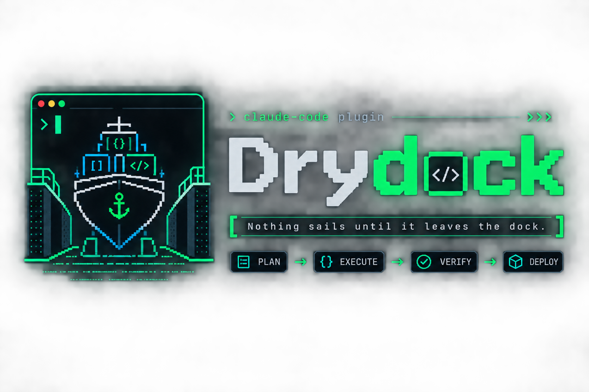

<p align="center">
  
</p>

Plan-first parallel execution for Claude Code: a rigorous plan document as
the source of truth, subagents executing it in parallel waves with disjoint
file ownership, a conformance audit gating every wave, and a reconcile loop
that feeds execution learnings back into your docs.

**Status: open pilot (v0.8.11).** Five plans have been planned, executed
and gated with it — see the [case study](docs/case-study-001-homepage.md) and
[docs/plans/](docs/plans/). Gate compliance is measured, not asserted: 28 of 29
wave gates invoked at their boundary across those 5 plans, **1 skipped** — and
the skip is the useful part, because the next gate refused to open on the
missing report and the retroactive audit found a real ownership breach behind
it. Every session knew it was observed, so the figure is a ceiling rather than a
rate, and it is published as PUBLISHED, **not** PASSED. From v0.6.0 ownership is
**enforced by a hook** rather than requested in prose — and as of 2026-08-22 that
hook is observed denying a real edit in a live session, not merely unit-tested
(A6). A plan can also carry a **Testing Gate**, which `seatrial` drives against
the running app through Playwright MCP, capturing the evidence each case declares
and closing with a go/no-go sheet; it has run end to end on this site (A7), where
its three designed-to-fail cases all failed as designed. What one run costs is
[published](docs/cost-001.md) — including the number that run never captured.
Behind it: an adversarial
[self-audit](docs/self-audit.md) of the auditor itself (it caught a lying
executor while all tests were green, and exposed + fixed a defect in our own
attribution design) and an honest
[compatibility checklist](docs/compatibility.md) of what's verified vs pending.

Homepage: <https://sandeeptakasi.github.io/drydock/> ·
Plugin: [`drydock/`](drydock/) ·
Lifecycle, pieces, and philosophy: [`drydock/README.md`](drydock/README.md)

```
/plugin marketplace add SandeepTakasi/drydock
/plugin install drydock@drydock
```
